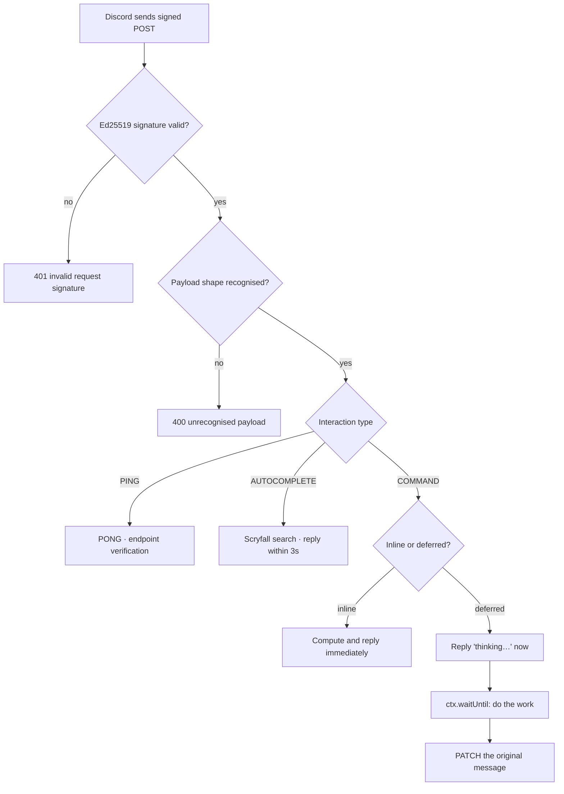

# Architecture

How MTG EDH Ladder is put together, and why. This is the reasoning behind the code — for
setup instructions see [README.md](README.md).

The whole system is one Cloudflare Worker (~2,000 lines of TypeScript across 17 modules)
and one D1 database. There is no server process, no queue, no cron, and no cache layer.

---

## Contents

- [Request lifecycle](#request-lifecycle)
- [The three-second problem](#the-three-second-problem)
- [Data model: store facts, derive everything else](#data-model-store-facts-derive-everything-else)
- [The live match card](#the-live-match-card)
- [Rating](#rating)
- [Deterministic tie handling](#deterministic-tie-handling)
- [Undo](#undo)
- [Scryfall integration](#scryfall-integration)
- [Security model](#security-model)
- [Known limitations](#known-limitations)
- [Testing strategy](#testing-strategy)

---

## Request lifecycle

Discord does not maintain a socket to this bot. It makes an HTTPS request per interaction,
which is what makes a serverless deployment viable — the Worker only exists while a command
is being handled.



`src/index.ts` owns the boundary: verify, parse, dispatch. `src/router.ts` owns the
inline/deferred decision. Everything past that point is ordinary application code that
never touches HTTP.

## The three-second problem

Discord closes an interaction that is not acknowledged within **three seconds**. Any real
work — a database round trip, an external API call — risks blowing that budget. The standard
answer is to immediately acknowledge with a "thinking…" placeholder and edit the message
later.

That would be the obvious blanket policy, but one command can't use it. `/game start` `@`
-mentions the pod, and a deferred placeholder that is later edited to contain mentions
**does not ping anyone**. The ping is the entire point — it's how the pod knows the game is
live. So `/game start` must answer inline, with its mentions present in the first response.

Hence a single command registry in `src/router.ts`, where each command declares its `mode`
and whether its reply is `ephemeral`:

- **inline** — `/game start`, `/help`. Answer directly (response type 4). `/game start`
  does one indexed lookup and two batched writes against a database in the same edge
  network, which sits comfortably inside the budget.
- **deferred** — everything else. Acknowledge (type 5), then `ctx.waitUntil()` keeps the
  Worker alive to finish the work and `PATCH` the original message.

Ephemerality is decided *here*, at acknowledgement time, and cannot be changed afterward —
you cannot make an already-sent reply private. The mid-game tweaks (`/commander`,
`/game bracket`, `/game cancel`) acknowledge ephemerally so their confirmations are visible
only to the caller; the shared [live card](#the-live-match-card) is what the channel sees.
The result-bearing commands stay public — `/game report` posts the final card for the whole
pod (and, being an interaction response, reaches the channel even if the bot can't edit the
original card), alongside the shared readouts `/leaderboard`, `/stats`, `/vs`, and `/undo`.

Autocomplete is a third case: it cannot be deferred at all. That constraint is what sets the
Scryfall timeout budget discussed [below](#scryfall-integration).

Both paths wrap handlers in try/catch and fall back to a friendly error embed, so an
unexpected throw surfaces as a message rather than a silently dead interaction.

## Data model: store facts, derive everything else

Four ideas drive the schema in [`schema.sql`](schema.sql):

**1. Only current ratings are stored on `players`.** Wins, losses, win rate, streaks, form,
placement spread and per-commander records are all computed on read from `games` joined with
`game_players`. Nothing needs to be incremented, so nothing can drift. A denormalised
`wins` column that disagrees with the game log is a class of bug this schema cannot have.

**2. `game_players` stores a rating snapshot per player per game** — `mu_before`/`mu_after`
and `sigma_before`/`sigma_after`. This is what makes `/undo` exact rather than approximate,
and it doubles as an audit trail of how any rating came to be. It also caches the commander
name and art URL, so re-rendering the live card on every command needs no Scryfall call.

**3. Guild is a column on every table**, with `UNIQUE (guild_id, discord_user_id)` on
players. Two servers running the same deployment keep entirely separate ladders. Games are
additionally scoped by channel, which is how "the active game in this channel" is meaningful.

**4. Game state is a status enum with a CHECK constraint** (`active` → `completed` /
`cancelled` / `undone`). Writes that advance state are guarded in the `WHERE` clause —
`UPDATE … WHERE id = ? AND status = 'active'` — so a stale request becomes a no-op rather
than corruption.

Three indexes cover every access path: active game by channel, recent games by guild, and
game history by player.

## The live match card

A pod used to generate a message per command — a "game on" post, one per `/commander`, a
bracket post, a result post. That is five-plus messages for one game, burying the channel.
Instead, a game now owns **one message that mutates** across its whole life: `/game start`
posts it, and every later command edits it in place.

The wrinkle is time. Discord's interaction token — the credential behind the existing
`PATCH …/@original` edit path — **expires 15 minutes** after the interaction. EDH games run
well past that. So the card cannot be maintained through interaction webhooks.

Editing a message with no time limit requires the **bot token** and
`PATCH /channels/{channel_id}/messages/{message_id}`. That is why the Worker now holds a bot
token (see [Security model](#security-model)) and why `games` gained a `message_id` column.

The flow, in `src/discord/`:

1. `/game start` answers inline (type 4), which pings the pod but does **not** return the
   created message object. So the router runs an `after` hook in `ctx.waitUntil` that
   `GET`s `…/@original` — using the still-valid interaction token — to learn the message id,
   and stores it on the game.
2. Each follow-up command does its write, then `updateLiveCard` re-reads the roster, renders
   the card, and edits the stored message with the bot token.
3. `renderMatchCard` (`card.ts`) is a **pure** function of a `MatchCardState` — phase,
   players, bracket, timings. That keeps the whole visual layer unit-testable with no
   database or network. A header embed carries pod size, bracket and a `<t:…:R>` relative
   timestamp — a live-ticking timer Discord updates client-side with zero edits from us —
   and one compact embed per player carries their commander art as a thumbnail.

**Every step degrades gracefully.** If the id capture in step 1 loses a race to a very fast
`/commander`, or the card was deleted, or the bot lost channel access, `updateLiveCard`
reposts a fresh card and relinks it, so the game self-heals rather than erroring. And because
a follow-up's own reply is ephemeral, the caller always gets a confirmation even if the
shared card cannot be reached.

**Every Discord API call must send a `DiscordBot (...)` User-Agent.** Discord sits behind
Cloudflare, whose WAF silently rejects bot-authenticated REST calls without one — as bare
`403`s that are indistinguishable from permission errors. This cost a full debugging session
that toured channel overrides, roles and a bot re-invite before the real culprit surfaced:
the same request that 403'd from a client with no UA returned `200` with one. If a Discord
call fails with 403 and the permissions look right, check the User-Agent before touching
the server settings. `src/discord/api.ts` centralises the header for exactly this reason.

## Rating

One rating, deliberately.

Elo assumes a two-player game. Commander is a four-player free-for-all where finishing 2nd
of 4 is meaningfully different from finishing 4th. TrueSkill models each player as a normal
distribution — μ (estimated skill) and σ (uncertainty) — and handles free-for-all rankings
natively. It's the lineage of the system Xbox Live uses to rank and match players.

Displayed as **SR**, from the conservative estimate `μ − 3σ`:

```
SR = round((μ − 3σ) × 40 + 500)
```

`μ − 3σ` is the rating we're ~99.7% confident the player exceeds. It lives on a roughly 0–50
scale, which reads as meaningless in a leaderboard, so it's scaled into FaceIt-like
territory. Using the conservative estimate rather than μ has a useful property: a new player
can't rocket to the top on one lucky win, because their σ is still large. Their SR climbs as
the system becomes *confident*, which is the honest thing to display.

`draw` gives every player the same rank; `winner_only` ranks 1st against an everyone-else-tied
field, so a pod can report "X won, we didn't track the rest" without inventing an ordering
nobody agreed on. An earlier version also ran a parallel pairwise Elo as a second, familiar
number; it was removed — one uncertainty-aware rating that actually models the pod beats two
numbers players have to reconcile.

## Deterministic tie handling

This is the subtlest part of the codebase.

TrueSkill resolves ties through adjacent-pair factors, which means the result depends
slightly on the **order** tied players are passed in. In practice the drift is under 0.01 μ,
but the implication is unacceptable: the arbitrary order in which the reporter happened to
fill the placement slots could change someone's rating.

`src/ratings/trueskill.ts` fixes this by canonicalising order before rating — sorting by
rank, then μ, then σ — computing, then mapping results back to the caller's original
indices:

```ts
const order = ratings
  .map((_, i) => i)
  .sort((a, b) =>
    ranks[a] - ranks[b] ||
    ratings[a].mu - ratings[b].mu ||
    ratings[a].sigma - ratings[b].sigma,
  );
```

The same pod with the same outcome now produces the same ratings regardless of who typed the
report or in what order. There is a unit test asserting exactly this.

## Undo

`/undo` reverts the most recent completed game by restoring each player's `*_before`
snapshot — not by recomputing, and not by applying an inverse. Restoring a stored value is
exact by construction.

**Only the newest completed game can be undone.** Ratings are path-dependent: game N+1 was
computed from the ratings game N produced. Undoing an older game would leave every snapshot
taken after it describing a history that no longer happened. Rather than silently corrupt
the chain, the constraint is enforced and explained in the error message.

The restore is a single `db.batch()` — the status flip and every player's rating restore
commit together or not at all.

## Scryfall integration

Commander names are canonicalised through [Scryfall](https://scryfall.com/docs/api) so stats
don't fragment. Without it, "atraxa", "Atraxa, Praetors Voice" and "Atraxa, Praetors' Voice"
become three different decks in the leaderboard.

Two paths:

- **Autocomplete** (`/cards/search`) as the user types. This cannot be deferred, so the
  budget is hard: **800 ms**, enforced with `AbortController`.
- **Resolution** (`/cards/named?fuzzy=`) when the command is submitted, turning
  `"urza lord high"` into `"Urza, Lord High Artificer"`. This runs inside an
  already-deferred command, so it can afford **1500 ms**.

Queries are normalised (case, punctuation) before both the cache lookup and the API call, so
`"Atraxa, Praetors'"` and `"atraxa praetors"` hit the same entry. Results are held in a
per-isolate `Map` with a 10-minute TTL and a 200-entry cap — Workers isolates are recycled
freely, so this is a genuine cache, not a source of truth.

**Every failure path degrades to storing exactly what the user typed**, with a note saying
so. A Scryfall outage makes commander names messier; it never blocks logging a game.
Partners are canonicalised individually then joined alphabetically, so
`Thrasios + Tymna` and `Tymna + Thrasios` are one deck identity.

## Security model

**Request authentication.** Discord signs every request with Ed25519. `src/index.ts`
verifies the signature against `DISCORD_PUBLIC_KEY` before parsing anything and returns 401
on failure. This is the only authentication the bot has or needs: a request that isn't from
Discord doesn't get past line 18. The smoke suite asserts that an unsigned request is
rejected.

**Secrets.** The Worker holds two secrets, both stored via `wrangler secret put` and never
in the repository: `DISCORD_PUBLIC_KEY` (verifies inbound requests) and, new with the live
card, `DISCORD_BOT_TOKEN`. The bot token is a genuine escalation worth naming plainly: the
Worker previously had *no* outbound write authority — it could only reply to requests that
were already proven to come from Discord. It now holds a credential that can post and edit
messages in any channel the bot can see. That is the price of editing a card after the
interaction token has expired; the token is scoped to the bot's own guild permissions
(View Channels, Send Messages) and is used only to render match cards. The same token is
also read by the local command-registration script from a gitignored `.dev.vars`.
Deployment config, including the D1 database id, is gitignored with a committed `.example`
template.

**SQL injection.** Every query is a prepared statement with `.bind()`. There is no string
concatenation anywhere in `src/db/queries.ts`, including the one dynamic fragment — the
`IN (…)` list in `upsertPlayers` builds placeholders, never values.

**Input validation.** Payload shape is checked before dispatch. Command inputs are validated
by pure functions in `src/validation.ts` before touching the database. Commander names are
length-capped. Bot accounts are rejected from pods.

**Authorisation.** Mutating a game requires being in that pod or holding
`ADMINISTRATOR`/`MANAGE_GUILD`. Notably `/commander` is *not* covered by that shared
predicate: it locates the caller's own roster row because it needs that `player_id` to write
against, and an admin has no `player_id` in a game they didn't play. Reusing the shared
check there would have granted a privilege that never existed.

## Known limitations

Documented rather than hidden.

**Concurrent reports of the same game.** `completeGame` runs as a `db.batch()` transaction
whose first statement is guarded by `status = 'active'`. If two players run `/game report`
simultaneously, both read the same pre-game ratings, and the second one's guarded status
update matches zero rows while its rating writes still apply. Because both computed from
identical inputs, identical placements produce identical results and the outcome is
unchanged. *Different* placements would let the second report's ratings win while the game
row keeps the first report's flags.

The fix would be to split the guard out and check the affected row count before writing
ratings — but D1 batches are the transaction boundary, so that trades real atomicity for
race detection. For a bot where a pod reports one game at a time in one channel, atomicity is
the better trade. Single-statement writes (`cancelGame`) *do* check their row count and
report honestly when they lose a race.

**No pagination.** `/leaderboard` returns the top 20 and `/stats` reads a player's full
history. Fine for a friend group; a server with thousands of games would want limits.

**Minimal migrations.** `schema.sql` is idempotent DDL (`CREATE TABLE IF NOT EXISTS`) and
represents the current shape, so a fresh install applies it and is done. Schema *changes* to
an existing database are hand-written `ALTER` scripts in `migrations/`, applied in order with
`wrangler d1 execute --file` (see the README's upgrade section). There is no automatic
migration runner that tracks which have been applied — for a bot whose schema moves rarely,
ordered files plus a one-line changelog per file is enough; a real runner is the obvious next
step if the schema starts moving often.

**Guild-only.** Every command requires server context; nothing works in DMs.

## Testing strategy

The expensive-to-test parts are deliberately kept free of I/O, which is what makes the
cheap tests meaningful.

**Unit tests (vitest)** cover the parts where correctness is subtle and silent failure is
likely: rating math (order independence, draws, winner-only, pod sizes 2–6), validation
predicates, the permission boundary including the admin case, payload parsing including
malformed input, undo snapshot restoration, commander normalisation and art extraction, and
the live-card renderer across every phase (active/completed/cancelled, draws, winner-only,
and the 10-embed ceiling). Keeping `renderMatchCard` a pure function of a state object is
what makes the entire visual layer testable this way — no mocks, no fixtures, no database.

**End-to-end smoke tests** (`scripts/local-smoke.mjs`) run against a real `wrangler dev`
instance with a throwaway Ed25519 keypair, sending genuinely signed interactions. They cover
what unit tests can't: signature rejection, PING/PONG endpoint verification, the inline and
deferred response shapes, and live Scryfall autocomplete.

CI runs typecheck, unit tests, and `npm audit --audit-level=high` on every push and pull
request.
