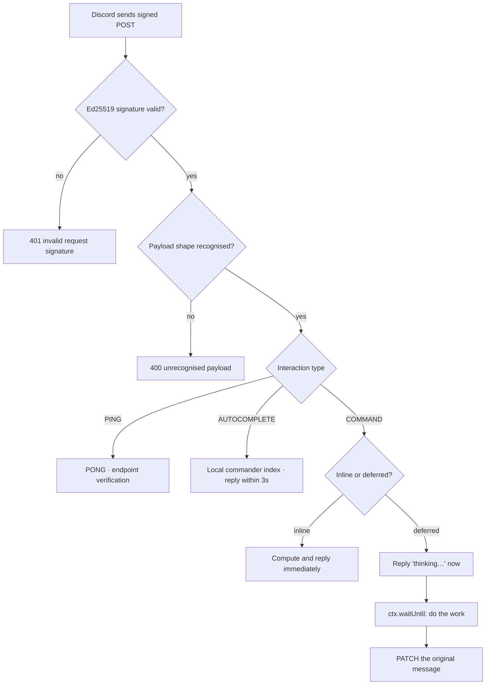

# Architecture

How MTG EDH Ladder is put together, and why. This is the reasoning behind the code — for
setup instructions see [README.md](README.md).

The whole system is one Cloudflare Worker (~2,000 lines of TypeScript across 17 modules)
and one D1 database. There is no server process, no queue, no cron, and no cache layer.

---

## Contents

- [Request lifecycle](#request-lifecycle)
- [The three-second problem](#the-three-second-problem)
- [Data model: store facts, derive everything else](#data-model-store-facts-derive-everything-else)
- [The live match card](#the-live-match-card)
- [Rating](#rating)
- [Rating dynamics](#rating-dynamics)
- [Deterministic tie handling](#deterministic-tie-handling)
- [Undo](#undo)
- [Commander index](#commander-index)
- [Security model](#security-model)
- [Known limitations](#known-limitations)
- [Testing strategy](#testing-strategy)

---

## Request lifecycle

Discord does not maintain a socket to this bot. It makes an HTTPS request per interaction,
which is what makes a serverless deployment viable — the Worker only exists while a command
is being handled.


```mermaid
flowchart TD
    A[Discord sends signed POST] --> B{Ed25519 signature valid?}
    B -- no --> C[401 invalid request signature]
    B -- yes --> D{Payload shape recognised?}
    D -- no --> E[400 unrecognised payload]
    D -- yes --> F{Interaction type}
    F -- PING --> G[PONG · endpoint verification]
    F -- AUTOCOMPLETE --> H[Local commander index · reply within 3s]
    F -- COMMAND --> I{Inline or deferred?}
    I -- inline --> J[Compute and reply immediately]
    I -- deferred --> K[Reply 'thinking…' now]
    K --> L[ctx.waitUntil: do the work]
    L --> M[PATCH the original message]
```

`src/index.ts` owns the boundary: verify, parse, dispatch. `src/router.ts` owns the
inline/deferred decision. Everything past that point is ordinary application code that
never touches HTTP.

## The three-second problem

Discord closes an interaction that is not acknowledged within **three seconds**. Any real
work — a database round trip, an external API call — risks blowing that budget. The standard
answer is to immediately acknowledge with a "thinking…" placeholder and edit the message
later.

That would be the obvious blanket policy, but one command can't use it. `/game start` `@`
-mentions the pod, and a deferred placeholder that is later edited to contain mentions
**does not ping anyone**. The ping is the entire point — it's how the pod knows the game is
live. So `/game start` must answer inline, with its mentions present in the first response.

Hence a single command registry in `src/router.ts`, where each command declares its `mode`
and whether its reply is `ephemeral`:

- **inline** — `/game start`, `/help`. Answer directly (response type 4). `/game start`
  does one indexed lookup and two batched writes against a database in the same edge
  network, which sits comfortably inside the budget.
- **deferred** — everything else. Acknowledge (type 5), then `ctx.waitUntil()` keeps the
  Worker alive to finish the work and `PATCH` the original message.

Ephemerality is decided *here*, at acknowledgement time, and cannot be changed afterward —
you cannot make an already-sent reply private. The mid-game tweaks (`/commander`,
`/game bracket`, `/game cancel`) acknowledge ephemerally so their confirmations are visible
only to the caller; the shared [live card](#the-live-match-card) is what the channel sees.
The result-bearing commands stay public — `/game report` posts the final card for the whole
pod (and, being an interaction response, reaches the channel even if the bot can't edit the
original card), alongside the shared readouts `/leaderboard`, `/stats`, `/vs`, and `/undo`.

Autocomplete is a third case: it cannot be deferred at all. That constraint is what sets the
commander lookup discussed [below](#commander-index).

Both paths wrap handlers in try/catch and fall back to a friendly error embed, so an
unexpected throw surfaces as a message rather than a silently dead interaction.

## Data model: store facts, derive everything else

Four ideas drive the schema in [`schema.sql`](schema.sql):

**1. Only current ratings are stored on `players`.** Wins, losses, win rate, streaks, form,
placement spread and per-commander records are all computed on read from `games` joined with
`game_players`. Nothing needs to be incremented, so nothing can drift. A denormalised
`wins` column that disagrees with the game log is a class of bug this schema cannot have.

**2. `game_players` stores a rating snapshot per player per game** — `mu_before`/`mu_after`
and `sigma_before`/`sigma_after`. This is what makes `/undo` exact rather than approximate,
and it doubles as an audit trail of how any rating came to be. It also caches the commander
name and art URL, so re-rendering the live card on every command needs no Scryfall call.

**3. Guild is a column on every table**, with `UNIQUE (guild_id, discord_user_id)` on
players. Two servers running the same deployment keep entirely separate ladders. Games are
additionally scoped by channel, which is how "the active game in this channel" is meaningful.

**4. Game state is a status enum with a CHECK constraint** (`active` → `completed` /
`cancelled` / `undone`). Writes that advance state are guarded in the `WHERE` clause —
`UPDATE … WHERE id = ? AND status = 'active'` — so a stale request becomes a no-op rather
than corruption.

Three indexes cover every access path: active game by channel, recent games by guild, and
game history by player.

## The live match card

A pod used to generate a message per command — a "game on" post, one per `/commander`, a
bracket post, a result post. That is five-plus messages for one game, burying the channel.
Instead, a game now owns **one message that mutates** across its whole life: `/game start`
posts it, and every later command edits it in place.

The wrinkle is time. Discord's interaction token — the credential behind the existing
`PATCH …/@original` edit path — **expires 15 minutes** after the interaction. EDH games run
well past that. So the card cannot be maintained through interaction webhooks.

Editing a message with no time limit requires the **bot token** and
`PATCH /channels/{channel_id}/messages/{message_id}`. That is why the Worker now holds a bot
token (see [Security model](#security-model)) and why `games` gained a `message_id` column.

The flow, in `src/discord/`:

1. `/game start` answers inline (type 4), which pings the pod but does **not** return the
   created message object. So the router runs an `after` hook in `ctx.waitUntil` that
   `GET`s `…/@original` — using the still-valid interaction token — to learn the message id,
   and stores it on the game.
2. Each follow-up command does its write, then `updateLiveCard` re-reads the roster, renders
   the card, and edits the stored message with the bot token.
3. `renderMatchCard` (`card.ts`) is a **pure** function of a `MatchCardState` — phase,
   players, bracket, timings. That keeps the whole visual layer unit-testable with no
   database or network. The card is built on Discord's **Components V2** (see below): one
   Container with an accent bar; a header carrying the pod pings and a `<t:…:R>` relative
   timestamp — a live-ticking timer Discord updates client-side with zero edits from us —
   then one Section per player with their commander art as a thumbnail (or a **Set**
   button while no deck is logged), and a row of **Set commander / Report result / Cancel
   game** buttons. The completed card leads with the winner's art in a media gallery,
   medals, SR deltas and rust notes, and has no buttons.

**Every step degrades gracefully.** If the id capture in step 1 loses a race to a very fast
`/commander`, or the card was deleted, or the bot lost channel access, `updateLiveCard`
reposts a fresh card and relinks it, so the game self-heals rather than erroring. And because
a follow-up's own reply is ephemeral, the caller always gets a confirmation even if the
shared card cannot be reached.

**When the card can't be reached, the reply says why — by status, not by guess.** Both
bot-token calls return the HTTP status plus Discord's own `{"message","code"}` body, and
`cardFailureHint` maps that to the fix: `401` → the `DISCORD_BOT_TOKEN` secret is stale or
corrupted (re-push it); `403` + code `50001` Missing Access → the bot can't see the channel
or isn't a guild member (re-invite with the `bot` scope); `403` + code `50013` Missing
Permissions → grant Send Messages; a bodiless `403` → the WAF (see below); `429` → retry.
Earlier versions printed "grant me View Channel + Send Messages" for every failure, which
sent an admin with correct permissions hunting through channel overrides while the real
fault was a rejected token. The other tell is that everything *else* keeps working: the
start card, the `/game report` card and the ephemeral confirmations all go through the
interaction webhook and never touch the bot token, so a bot whose token is dead looks
healthy right up until the first live-card edit.

### Components V2 and the buttons

Type numbers, limits and interaction rules were verified against
[docs.discord.com/developers/components/reference](https://docs.discord.com/developers/components/reference)
and [receiving-and-responding](https://docs.discord.com/developers/interactions/receiving-and-responding)
on 2026-09-13 and are encoded once in `src/discord/components.ts`. The rules that shape the
code:

- A V2 message carries the `IS_COMPONENTS_V2` flag (`1 << 15`), **cannot** carry `content` or
  `embeds`, and the flag **cannot be removed** once a message has it. `withV2()` in
  `src/discord/api.ts` is the single place the flag is set — every send/edit passes through
  it, and it throws if a message mixes the two worlds, so that class of bug is a test
  failure rather than a Discord 400. Plain confirmations and errors stay classic embeds.
- A deferred acknowledgement (type 5) may carry only the `EPHEMERAL` flag; the V2 payload
  goes on the follow-up edit. Type 4 may carry V2 directly, which is why `/game start`'s
  inline reply (the one that pings) still works unchanged.
- Limits: 40 components per message, 4,000 characters per text display, 100-character
  custom ids, 25 select options, 5 buttons per row, 1–5 components per modal. A six-player
  card is 28 components; tests assert every phase × pod size stays under the caps.

**Buttons hold no state.** Every custom id follows `<ns>:<verb>:<gameId>[:args]`
(`src/discord/custom-id.ts`), and everything a click needs is either in the id or re-read
from the database. The report flow is the interesting case: the draft — mode (full /
winner-only / draw) plus the picks so far as roster indices — travels inside the id
(`rep:pick:42:f:2-0`), so there is no drafts table, no TTL, no cross-player collision, and
a six-player full report is a 32-character id. Roster indices are stable because `getRoster`
orders by player id. Every step re-checks that the game is still the channel's active one
(a click on a stale card is refused, never acted on) and that the clicker is in the pod or
an admin; the final Confirm goes through the same `reportGame()` service as `/game report`,
so the two paths cannot drift.

**Setting a commander from the card** offers the player's recent decks first (one click),
then a search modal. A typo or a shared short name lands on a "did you mean" select rather
than being guessed. Only the player's own seat can be set — the same rule as `/commander`,
so an admin is not offered a seat they never sat in. The modal has no select menu in it:
modal selects are the least-settled part of the spec, and the ephemeral picker covers the
need with primitives that are certain.

**Responding within three seconds.** Picking steps answer with `UPDATE_MESSAGE` (type 7)
inline — one indexed read and a pure render. Anything that writes and then edits the live
card defers (type 6 or 5) and finishes in `ctx.waitUntil`, editing `@original` — which for a
component interaction is the message the component sits on.

**Every Discord API call must send a `DiscordBot (...)` User-Agent.** Discord sits behind
Cloudflare, whose WAF silently rejects bot-authenticated REST calls without one — as bare
`403`s that are indistinguishable from permission errors. This cost a full debugging session
that toured channel overrides, roles and a bot re-invite before the real culprit surfaced:
the same request that 403'd from a client with no UA returned `200` with one. If a Discord
call fails with 403 and the permissions look right, check the User-Agent before touching
the server settings. `src/discord/api.ts` centralises the header for exactly this reason.

## Rating

One rating, deliberately.

Elo assumes a two-player game. Commander is a four-player free-for-all where finishing 2nd
of 4 is meaningfully different from finishing 4th. TrueSkill models each player as a normal
distribution — μ (estimated skill) and σ (uncertainty) — and handles free-for-all rankings
natively. It's the lineage of the system Xbox Live uses to rank and match players.

Displayed as **SR**, from the conservative estimate `μ − 3σ`:

```
SR = round((μ − 3σ) × 40 + 500)
```

`μ − 3σ` is the rating we're ~99.7% confident the player exceeds. It lives on a roughly 0–50
scale, which reads as meaningless in a leaderboard, so it's scaled into FaceIt-like
territory. Using the conservative estimate rather than μ has a useful property: a new player
can't rocket to the top on one lucky win, because their σ is still large. Their SR climbs as
the system becomes *confident*, which is the honest thing to display.

`draw` gives every player the same rank; `winner_only` ranks 1st against an everyone-else-tied
field, so a pod can report "X won, we didn't track the rest" without inventing an ordering
nobody agreed on. An earlier version also ran a parallel pairwise Elo as a second, familiar
number; it was removed — one uncertainty-aware rating that actually models the pod beats two
numbers players have to reconcile.

## Rating dynamics

The first version ran TrueSkill with its defaults, and in a closed group that plays each
other every week the ratings went stale: σ collapsed to ~0.7 within a few dozen games, a
4-pod win moved the winner +6 SR, and the order froze because nothing could cross a 100-SR
gap. Two changes, both in `src/ratings/config.ts`, fix that; the numbers there were
measured by simulation with `ts-trueskill` itself.

**Motion (τ).** TrueSkill inflates σ² by τ² before every game so skill is allowed to drift.
The default is σ₀/100 ≈ 0.083; the bot uses σ₀/12 ≈ 0.694. Settled σ lands near 2.0
instead of 0.7, and the same 4-pod finish is worth +45 / +17 / −10 / −45 SR. A floor
(`SIGMA_MIN` = 1.5) is applied to every stored σ as a backstop: below ~1.25 the winner of an
even pod gains nothing, which is the degenerate case being excluded.

**Rust.** At report time each player's σ is inflated for time away from the table:

```
σ' = min(σ₀, sqrt(σ² + K² · max(0, daysIdle − 7)))        K = 0.5
```

From σ = 2.0 that is 2.40 after 14 idle days (−48 SR), 3.12 after 30 (−135), 4.15 after 60.
It reads as harsh until the recovery is seen: a rusted player at σ = 4 who wins a pod of
settled players gains about +200 SR in that one game. Rust means "provisional again", not
"demoted". `daysIdle` is measured from the player's last completed game to *this* game's
timestamp — never the wall clock — so a replay reproduces every historical value exactly.

**Rust and undo.** `sigma_before` keeps its meaning: the σ that was stored before the report,
which is what `/undo` restores, exact by construction. The inflated value the engine actually
saw is recorded separately as `sigma_rusted` (NULL when no rust applied), with `rust_days`
for display. Storing the rusted value in `sigma_before` would leave an undone player
permanently rusted; storing only the raw value would make the snapshot unable to explain
`mu_after`. So both are kept.

**Recompute.** Constants only affect future games, and the user's *history* is what felt
stale, so `scripts/recompute-ratings.mjs` replays every completed game in order through the
same `src/ratings/*.ts` the Worker runs (imported directly under Node's type stripping — one
engine, no reimplementation), rewriting the snapshots, `games.top_player_id` and the current
ratings. It is a script rather than an admin route: the Worker's only authentication is
Discord's request signature, and a secret-guarded public route would be a new attack surface
for something run a couple of times a year. Dry run by default; `--apply` takes a D1 export
first; refuses while a game is active; idempotent, so a half-finished run is repaired by
re-running.

**Predict.** `/predict` samples each player's performance from N(μ, σ² + β²) a few thousand
times (seeded by the game id, so it is deterministic) and counts first places. The same
odds, computed inside the report, drive the "upset" shoutout.

## Deterministic tie handling

This is the subtlest part of the codebase.

TrueSkill resolves ties through adjacent-pair factors, which means the result depends
slightly on the **order** tied players are passed in. In practice the drift is under 0.01 μ,
but the implication is unacceptable: the arbitrary order in which the reporter happened to
fill the placement slots could change someone's rating.

`src/ratings/trueskill.ts` fixes this by canonicalising order before rating — sorting by
rank, then μ, then σ — computing, then mapping results back to the caller's original
indices:

```ts
const order = ratings
  .map((_, i) => i)
  .sort((a, b) =>
    ranks[a] - ranks[b] ||
    ratings[a].mu - ratings[b].mu ||
    ratings[a].sigma - ratings[b].sigma,
  );
```

The same pod with the same outcome now produces the same ratings regardless of who typed the
report or in what order. There is a unit test asserting exactly this.

## Undo

`/undo` reverts the most recent completed game by restoring each player's `*_before`
snapshot — not by recomputing, and not by applying an inverse. Restoring a stored value is
exact by construction.

**Only the newest completed game can be undone.** Ratings are path-dependent: game N+1 was
computed from the ratings game N produced. Undoing an older game would leave every snapshot
taken after it describing a history that no longer happened. Rather than silently corrupt
the chain, the constraint is enforced and explained in the error message.

The restore is a single `db.batch()` — the status flip and every player's rating restore
commit together or not at all.

## Commander index

Commander names are canonicalised so stats don't fragment: without it, "atraxa",
"Atraxa, Praetors Voice" and "Atraxa, Praetors' Voice" become three different decks in the
leaderboard. The first version did this by calling [Scryfall](https://scryfall.com/docs/api)
live on every keystroke, which had two problems. Autocomplete cannot be deferred, so the
call had an 800 ms budget and a slow Scryfall meant an empty list; and Scryfall's search is
literal, so a typo ("atraxa preators") found nothing at all.

The index replaces the live call with a local copy. `npm run sync-commanders` pages through
Scryfall's `is:commander legal:commander` search (about 3,400 cards, 20 pages) and upserts
one row per card into the `commanders` table: exact name, a pre-normalised name, the short
name before the first comma, colour identity, EDHREC rank, art URLs and a partner-mechanic
bitmask. The parser (`src/commanders/sync.ts`) is pure and shared with the tests; the script
imports it directly under Node's type stripping, so there is one definition of what a record
looks like.

**Why a script and not a cron.** The Workers Free plan gives an invocation 10 ms of CPU.
One Scryfall page is ~950 KB of JSON; parsing it alone blows that budget, so a `scheduled`
handler is not an option on that plan. A monthly `npm run sync-commanders` is the supported
path; a stale index only means the newest commanders fall back to a live Scryfall lookup.

**Search** (`src/commanders/search.ts`) is a pure function of an in-memory index and a query.
The index is loaded once per isolate — ~3,400 rows of name/rank/colour columns, ~250 KB —
and every query is scored in tiers:

| tier | match | example |
|---|---|---|
| 0 exact | normalised name equal | `atraxa praetors voice` |
| 1 short | name before the comma, or a DFC's front face | `atraxa`, `birgi` |
| 2 alias | hard-coded community nicknames (`src/commanders/aliases.ts`) | `urdragon`, `krrik` |
| 3 prefix | full name starts with the query | `urza lord high` |
| 4 word prefix | an inner word starts with the query | `praetors` |
| 5 token set | every query word is a prefix of a distinct name word, any order | `weaver tymna` |
| 6 substring | anywhere in the name, spaces optional | `zegana` |
| 7 fuzzy | bounded Damerau-Levenshtein per word: one edit for 4+ letters, two for 7+ | `atraxa preators` |

Within a tier, EDHREC rank breaks ties, so `urza` leads with Lord High Artificer. The fuzzy
pass is the only expensive one and runs only when the cheaper tiers under-fill the list;
measured cost is under 3 ms per query. Normalisation strips case, punctuation and diacritics
identically on both sides (`Lim-Dûl` ≡ `lim dul`) and is done once at sync time for the
index, so building it in a fresh isolate costs single-digit milliseconds.

**Resolution** (`/commander` submit) is deliberately more cautious than autocomplete. A tier-0
hit, or a hit with nothing else at its tier, is committed silently. A shared short name
(`atraxa` matches two cards) or any fuzzy hit is *ambiguous*: the bot stores the top
candidate but says so in its reply and lists the alternatives, so a wrong guess is visible
and one re-run away from fixed. Nothing ever blocks logging a deck — an unmatched name is
stored as typed with a note, exactly as before.

**Cold start.** The first autocomplete after an isolate spins up cannot wait for the index
to build, so it answers from an indexed `LIKE` prefix query while `ctx.waitUntil` builds the
in-memory index for the next keystroke. If that build is killed by the CPU limit, the load
is retried rather than awaited forever — a stuck promise there would hang every later
`/commander`.

**Fallback.** Every entry point checks whether the index has rows. An empty or missing table
(fresh install, migration not applied) routes to the original live-Scryfall code in
`src/scryfall.ts`, so the bot behaves exactly as it did before the index existed.
Partners are canonicalised individually then joined alphabetically, so `Thrasios + Tymna`
and `Tymna + Thrasios` are one deck identity.

## Security model

**Request authentication.** Discord signs every request with Ed25519. `src/index.ts`
verifies the signature against `DISCORD_PUBLIC_KEY` before parsing anything and returns 401
on failure. This is the only authentication the bot has or needs: a request that isn't from
Discord doesn't get past line 18. The smoke suite asserts that an unsigned request is
rejected.

**Secrets.** The Worker holds two secrets, both stored via `wrangler secret put` and never
in the repository: `DISCORD_PUBLIC_KEY` (verifies inbound requests) and, new with the live
card, `DISCORD_BOT_TOKEN`. The bot token is a genuine escalation worth naming plainly: the
Worker previously had *no* outbound write authority — it could only reply to requests that
were already proven to come from Discord. It now holds a credential that can post and edit
messages in any channel the bot can see. That is the price of editing a card after the
interaction token has expired; the token is scoped to the bot's own guild permissions
(View Channels, Send Messages) and is used only to render match cards. The same token is
also read by the local command-registration script from a gitignored `.dev.vars`.
Deployment config, including the D1 database id, is gitignored with a committed `.example`
template.

**SQL injection.** Every query is a prepared statement with `.bind()`. There is no string
concatenation anywhere in `src/db/queries.ts`, including the one dynamic fragment — the
`IN (…)` list in `upsertPlayers` builds placeholders, never values.

**Input validation.** Payload shape is checked before dispatch. Command inputs are validated
by pure functions in `src/validation.ts` before touching the database. Commander names are
length-capped. Bot accounts are rejected from pods.

**Authorisation.** Mutating a game requires being in that pod or holding
`ADMINISTRATOR`/`MANAGE_GUILD`. Notably `/commander` is *not* covered by that shared
predicate: it locates the caller's own roster row because it needs that `player_id` to write
against, and an admin has no `player_id` in a game they didn't play. Reusing the shared
check there would have granted a privilege that never existed.

## Known limitations

Documented rather than hidden.

**Concurrent reports of the same game.** `completeGame` runs as a `db.batch()` transaction
whose first statement is guarded by `status = 'active'`. If two players run `/game report`
simultaneously, both read the same pre-game ratings, and the second one's guarded status
update matches zero rows while its rating writes still apply. Because both computed from
identical inputs, identical placements produce identical results and the outcome is
unchanged. *Different* placements would let the second report's ratings win while the game
row keeps the first report's flags.

The fix would be to split the guard out and check the affected row count before writing
ratings — but D1 batches are the transaction boundary, so that trades real atomicity for
race detection. For a bot where a pod reports one game at a time in one channel, atomicity is
the better trade. Single-statement writes (`cancelGame`) *do* check their row count and
report honestly when they lose a race.

**Pagination is by buttons, not cursors.** `/leaderboard`, `/meta` and `/history` page with
◀ ▶ buttons carrying the page number; `/stats` reads a player's full history. Fine for a
friend group; a server with thousands of games would want limits everywhere.

**Minimal migrations.** `schema.sql` is idempotent DDL (`CREATE TABLE IF NOT EXISTS`) and
represents the current shape, so a fresh install applies it and is done. Schema *changes* to
an existing database are hand-written `ALTER` scripts in `migrations/`, applied in order with
`wrangler d1 execute --file` (see the README's upgrade section). There is no automatic
migration runner that tracks which have been applied — for a bot whose schema moves rarely,
ordered files plus a one-line changelog per file is enough; a real runner is the obvious next
step if the schema starts moving often.

**Guild-only.** Every command requires server context; nothing works in DMs.

**Cards posted before the Components V2 switch cannot be edited into the new shape.** The
flag is one-way, so an edit to an old embed card 400s; `updateLiveCard` already reposts on
any edit failure, so an in-flight game across the deploy gets a fresh card and the stale
embed stays in the scrollback. Finish or cancel open games before deploying.

**The weekly digest runs on a cron with no user in the loop.** Its failures are only
visible in `wrangler tail`. A digest channel the bot can no longer post to (403/404) clears
the setting automatically rather than failing every Monday forever; any other error is
logged per guild and the loop continues.

## Testing strategy

The expensive-to-test parts are deliberately kept free of I/O, which is what makes the
cheap tests meaningful.

**Unit tests (vitest)** cover the parts where correctness is subtle and silent failure is
likely: rating math (order independence, draws, winner-only, pod sizes 2–6), validation
predicates, the permission boundary including the admin case, payload parsing including
malformed input, undo snapshot restoration, commander search (every tier, typo tolerance,
ranking, the confidence rule) against a fixture of real Scryfall cards, the Scryfall page
parser, the index-or-fallback routing with a fake D1, and
the live-card renderer across every phase (active/completed/cancelled, draws, winner-only,
and the 10-embed ceiling). Keeping `renderMatchCard` a pure function of a state object is
what makes the entire visual layer testable this way — no mocks, no fixtures, no database.

**End-to-end smoke tests** (`scripts/local-smoke.mjs`) run against a real `wrangler dev`
instance with a throwaway Ed25519 keypair, sending genuinely signed interactions. They cover
what unit tests can't: signature rejection, PING/PONG endpoint verification, the inline and
deferred response shapes, and commander autocomplete against the local index (including a
typo, when the local index has been synced).

CI runs typecheck, unit tests, and `npm audit --audit-level=high` on every push and pull
request.
